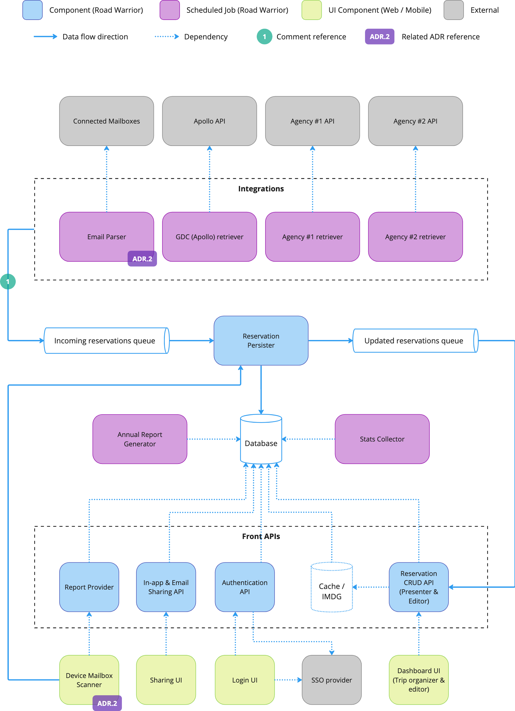

# The Road Warrior

Submission repo of DevexSolar team for the [O'Reilly Architectural Katas 2023](https://learning.oreilly.com/live-events/architectural-katas/0636920097101/) challenge.

## Problem

### Requirements

A new startup wants to build the next generation online trip management dashboard to allow travelers to see all of their existing reservations organized by trips. The users should be able to use the application either through Web or through their mobile devices.

The platform will collect reservations data by parsing users' emails or by interfacing with external systems. Users will be able to manually add, modify or remove reservations. They will see a dashboard with their upcoming trips, will post trip details to social media sites or will share directly with targeted people. 

The startup expects 15M registered users in the platform, having 2M of them be active active on a weekly basis. The startup also has a strict technical requirements for unplanned downtime (<5 mins per month), integration time (5 minutes), and response time (0.8s for Web and 1.4s for mobile).

### Assumptions

Based on the limited available requirements, we had to make a number of assumptions about the product scope:

- The startup has a limited budget and time to produce a MVP.
- We must design an architecture for a greenfield product.
- The startup is not affiliated with any given travel agency. Therefore, there will be multiple sources of reservations data and new sources can be plugged-in at any time in the future.
- Reservations data can be retrieved in 3 ways - email parsing, APIs of travel companies (airlines, hotels, car rentals) and APIs of global distribution systems (such as SABRE and APOLLO).
- Retrieved data will be "read-only" and the platform will not initiate any updates on the reservations.

## Approach

We followed an architecture design approach with the steps below:

1) Acknowledge requirements
2) Define required assumptions to clarify the scope
3) Identify product capabilities and high-level components using the Actor/Action approach
4) Analyze architecture characteristics
5) Define the most appropriate architecture style
6) Restructure the components
7) Prepare an overall logical component diagram
8) Prepare a physical component diagram
9) Prepare additional diagrams to focus on key solution components
10) Document as ADRs the decisions we made throughout the entire process

We used Miro as a tool for both drawing and collaboration.

We had 5 days to design the architecture, so we conducted a multiple brainstorming sessions, as well as daily sync-up meetings.

The deliverables of our architecture design are presented in the next section.

## Solution

### Capabilities

To illustrate the needs which the architecture must satisfy, We started the architecture design with outlining the different types of actors in the system and their actions. Then we prepared a draft list of the components that are required to cover those actions.

We created the following capabilities diagram:

<figure>
  
  <figcaption>Capabilities diagram</figcaption>
</figure>

### Architecture Characteristics

Based on the provided functional and non-functional requirements, we have identified the following important architecture characteristics:

| Architecture Characteristic | Rationale | Reference to requirements |
| --- | --- | --- |
| **Feasibility (cost/time)** | This is an implicit characteristic that takes into account the tight timeframes and budget to implement a product MVP. | *"A new startup wants to build..."* |
| **Scalability** | The system capacity will significantly grow over time, and the number of users and requests will increase respectively. | *"2 million active users/week... 15 million total accounts"* |
| **Availability** | There is a strict requirement on the amount of uptime of the system. | *"max 5 minutes per month of unplanned downtime"* |
| **Responsiveness** | There is a strict requirement on the amount of time it takes to get a response to the user. | *"Response time from web (800ms) and mobile (First-contentful paint of under 1.4 sec)"* |
| **Interoperability** | The system must be integrated with a large number of third-party system to capture the reservation data. | *"must integrate seamlessly with existing travel systems..."* |
| **Extensibility** | The system will be gradually extended with more types of reservations and more data sources. | *"The system must interface with the agency’s existing airline, hotel, and car rental interface system..."* |

### Architecture Style

Based on the (1) identified functional domain and capabilties and the (2) justified key architecture characteristics, we decided to design architecture in a hybrid style, combining the key aspects of the microkernel architecture and event-driven architecture.

More details about this decision are presented in the respective ADR: [Architecture style](ADRs/overall-architecture-style.md)

### Components
The diagram below gives a high-level overview of how the logical components interact with each other as well as with 
external service providers.

<figure>
  
  <figcaption>High-level architecture diagram</figcaption>
</figure>

TODO - DC: comments

### Deployment

TODO - Deployment diagram here

## Architecture Decision Records

* ADR.1 [Architecture Style](./ADRs/overall-architecture-style.md) 
* ADR.2 [E-mail Processing](./ADRs/email-processing.md)
* ADR.3 [Responsiveness (Caching)](./ADRs/responsiveness.md)
* TODO ADR.4 for blue-green and HA&DR
* TODO ADR.5 for cloud deployment 
* ADR.6 [Event bus](./ADRs/event-bus.md)
* TODO ADR.7 noSql database (flex data structure, replication, GridFS [mongo])
* TODO ADR.8 CQRS & approach to breaking down components

## References

TODO - List of references
