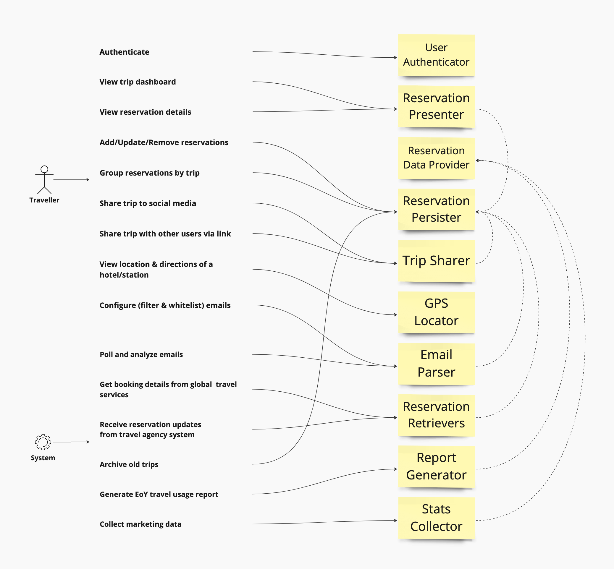
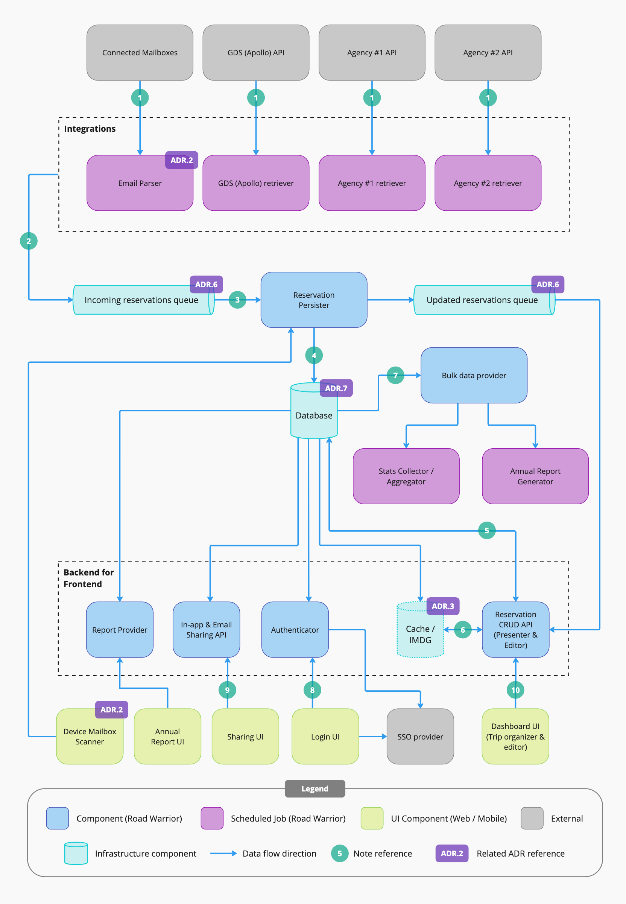
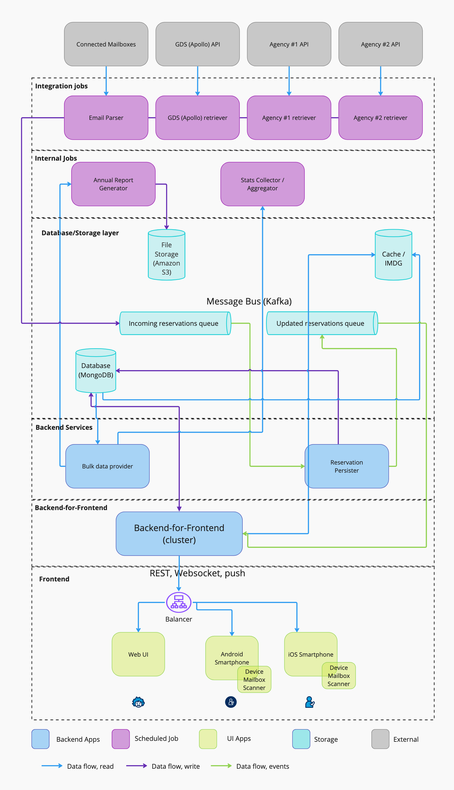

# The Road Warrior

Submission repo of **DevexSolar** team for the
[O'Reilly Architectural Katas 2023](https://learning.oreilly.com/live-events/architectural-katas/0636920097101/)
challenge.

## Contents

<!-- TOC -->

* [Problem](#problem)
  * [Requirements](#requirements)
  * [Assumptions](#assumptions)
* [Approach](#approach)
* [Solution](#solution)
  * [Capabilities](#capabilities)
  * [Architecture Characteristics](#architecture-characteristics)
  * [Architecture Style](#architecture-style)
  * [Components](#components)
    * [Logical component diagram](#logical-component-diagram)
    * [Physical component diagram](#physical-component-diagram)
* [Architecture Decision Records](#architecture-decision-records)
* [References](#references)

<!-- TOC -->

## Problem

### Requirements

A new startup wants to build a next generation online trip management dashboard to allow travelers to see all of
their existing reservations organized by trips. The users should be able to use the application either through Web
or their mobile devices.

The platform will collect reservations data by parsing users' emails and by interfacing with external systems.
Users will be able to manually add, modify or remove reservations. They will see a dashboard with their upcoming
trips, will post trip details to social media sites or will share directly with targeted people.

The startup expects 15M registered users in the platform, having 2M of them be active on a weekly basis. The
startup also has a strict technical requirements for unplanned downtime (less than 5 minutes per month, equivalent
to 99.98% availability), integration time (5 minutes), and response time (0.8s for Web and 1.4s for mobile).

### Assumptions

Based on the limited available requirements, we had to make a number of assumptions about the product scope:

* The startup has a limited budget and time to produce a MVP.
* We must design an architecture for a greenfield product.
* The startup is not affiliated with any given travel agency. Therefore, there will be multiple sources of reservations
  data and new sources can be plugged-in at any time in the future.
* Reservations data can be retrieved in 3 ways - email parsing, APIs of travel companies (airlines, hotels, car rentals)
  and APIs of global distribution systems (such as SABRE and APOLLO).
* Retrieved data will be _read-only_ and the platform will not initiate any updates on the reservations.

## Approach

We followed an architecture design approach with the steps below:

1. Acknowledge requirements
2. Define required assumptions to clarify the scope
3. Identify product capabilities and high-level components using the Actor/Action approach
4. Analyze architecture characteristics
5. Define the most appropriate architecture style
6. Restructure the components
7. Prepare an overall logical component diagram
8. Prepare a physical component diagram
9. Prepare additional diagrams to focus on key solution components
10. Document as ADRs the decisions we made throughout the entire process

We used [Miro](https://miro.com) as a tool for both drawing and collaboration.

We had 5 days to design the architecture, so we conducted a multiple brainstorming sessions, as well as daily sync-up
meetings.

The deliverables of our architecture design are presented in the next section.

## Solution

### Capabilities

To illustrate the needs which the architecture must satisfy, we started the architecture design with outlining the
different types of actors in the system and their actions. Then we prepared a draft list of the components that are
required to cover those actions.

We created the following capabilities diagram:

<figure>
  
  <figcaption style="font-style: italic;text-align: center">Figure 1. Capabilities diagram</figcaption>
</figure>

### Architecture Characteristics

Based on the provided functional and non-functional requirements, we have identified the following important
architecture characteristics:

| Architecture Characteristic      | Rationale                                                                                                                                                                                                                                                                                   | Reference to requirements                                                                                   |
|----------------------------------|---------------------------------------------------------------------------------------------------------------------------------------------------------------------------------------------------------------------------------------------------------------------------------------------|-------------------------------------------------------------------------------------------------------------|
| **Feasibility (cost/time)**      | This is an implicit characteristic that takes into account the tight time frame and budget to implement a product MVP.                                                                                                                                                                      | *"A new startup wants to build..."*                                                                         |
| **Scalability** / **Elasticity** | The system capacity will significantly grow over time, and the number of users and requests will increase respectively. Also, we anticipate spikes of user activity on weekends and cool down on working days, so system should be also elastic enough to scale not only up, but also down. | *"2 million active users/week... 15 million total accounts"*                                                |
| **Availability**                 | There is a strict requirement on the amount of uptime of the system.                                                                                                                                                                                                                        | *"max 5 minutes per month of unplanned downtime"*                                                           |
| **Responsiveness**               | There is a strict requirement on the amount of time it takes to get a response to the user.                                                                                                                                                                                                 | *"Response time from web (800ms) and mobile (First-contentful paint of under 1.4 sec)"*                     |
| **Interoperability**             | The system must be integrated with a large number of third-party system to capture the reservation data.                                                                                                                                                                                    | *"must integrate seamlessly with existing travel systems..."*                                               |
| **Extensibility**                | The system will be gradually extended with more types of reservations and more data sources.                                                                                                                                                                                                | *"The system must interface with the agency’s existing airline, hotel, and car rental interface system..."* |

### Architecture Style

Based on the (1) identified functional domain and capabilities and the (2) justified key architecture characteristics,
we decided to design architecture in a hybrid style, combining the key aspects of the microkernel architecture and
event-driven architecture.

More details about this decision are presented in the respective
ADR: [Architecture style](ADRs/overall-architecture-style.md)

### Components

#### Logical component diagram

The diagram below gives a high-level overview of how the logical components interact with each other as well as with
external service providers.

<figure>
  
  <figcaption style="font-style: italic;text-align: center">Figure 2. Logical component diagram</figcaption>
</figure>

Diagram notes and component descriptions:

1. Agency retrievers, GDS (Apollo) retriever, Email parser are event parsers reading their sources and sending the
   standard JSON message to a Message bus for processing and storage. They may include different fields (extended fields as per
   provider), but follow at least basic fields from the Domain model. See [ADR.2](ADRs/email-processing.md) for more 
   details on E-mail processing.
2. The **Message bus** is a scalable distributed event-streaming platform, working across multiple regions, and 
   persistent. Kafka is a good choice here. Please refer to [ADR.6](ADRs/event-bus.md) for more information.
3. **Reservation Persister** is a backend API for storing data to a database (by the event parsers, which publish data
   to message bus) and sending events (different event types - suitable for UI updates) about updates to message bus
   for "Presenter" to update its cache/update UIs immediately. The same storage and sending update events code is shared
   between this component and the "write" part of the **Reservation CRUD API** below.
4. **Database** will contain both initial events and current state of the reservations, up to date. It's **Reservation
   Persister**'s job to calculate the final state. Yearly per-user reports are being stored in PDF files on the
   disk (e.g. Amazon S3) and the database contains just the links to generated reports when they are ready in
   simple `<user>-<year>-<filename>` filename pattern. Please refer to [ADR.7](ADRs/efficient-data-storage.md) for more 
   information. 
5. **Reservation CRUD API** incorporates REST API operations for reading and modifying contents of the trip that
   displayed in the Trip Dashboard UI in the client-facing apps (web and mobile). Besides REST API methods it also
   provides WebSocket-based endpoint that notifies the front-end app for any changes that should force the user view to be updated. Backend instances subscribe to reservation update messages in the message bus, filtering by IDs of users who are logged in to this particular instance. When update message comes, the UI is refreshed (backend sends
   Websocket and Mobile Push message to UI), and then the distributed cache entry gets updated with the new info
   (alternatively, the entry is evicted and later pulled up from the database when necessary).
6. **Distributed** cache - should work across regions, scale to 15M user trips (approx 100M trips), is a
   read-through cache, should support ways to update data (like, evict entry).
7. **Bulk Data Provider** is a backend API for reading bulk or historical data from the database, for usage by **Report Generator**
   and **Stats Collector**. This component should scale separately to optimize the queries. Also, it can work based on
   a read-only DB replica.
8. **Authenticator** is a backend component for authentication and authorization, it supports token sharing/validation with an
   external authentication provider (e.g. Auth0). It should support login via variety of providers including Google and major
   social networks. It is being addressed on all the calls from UI/APIs to check whether token is valid. Separate
   roles for backend components should be provided there so that we know who did what (audit).
9. **In-app & E-mail Sharing API** is a small backend component that supports in-app sharing (for the "Trips Shared
   with Me" section of Dashboard UI) and also performed E-mail invitation for unregistered users.
10. Local storage and Mobile in-app storage should cache recent data to present the recent trip info in offline mode
    and/or present the past data when app is still loading.

#### Physical component diagram

The purpose of the following diagram is to show layers of the physical components so that devops can start planning
the deployment. This is not much different from above, but aggregated UI components and backend APIs for UI into
Backend-for-Frontend, as we believe from deployment standpoint it's easier, and anyway the same team is gonna
work on that. Also, we find this important to emphasize there is a load-balancer between UI and BFF.

<figure>
  
  <figcaption style="font-style: italic;text-align: center">Figure 3. Physical component diagram (layered)</figcaption>
</figure>

## Architecture Decision Records

* ADR.1 [Architecture Style](ADRs/overall-architecture-style.md)
* ADR.2 [E-mail Processing](ADRs/email-processing.md)
* ADR.3 [Responsiveness (Caching)](ADRs/responsiveness.md)
* ADR.4 [High Availability and Disaster Recovery](ADRs/hadr.md)
* ADR.5 [Cloud Deployment](ADRs/cloud-deployment.md)
* ADR.6 [Event bus](ADRs/event-bus.md)
* ADR.7 [Efficient data storage](ADRs/efficient-data-storage.md)
* ADR.8 [CQRS and scalability](ADRs/cqrs.md)

## References

* [Microkernel architecture pattern](https://learning.oreilly.com/library/view/software-architecture-patterns/9781491971437/ch03.html#idm46407727649072)
* [Event-driven architecture pattern](https://learning.oreilly.com/library/view/software-architecture-patterns/9781491971437/ch02.html)
* [CQRS pattern](http://www.eventstore.com/cqrs-pattern)
* [Blue-green deployment technique](https://docs.cloudfoundry.org/devguide/deploy-apps/blue-green.html)
* [SQL vs NoSQL database](https://www.integrate.io/blog/the-sql-vs-nosql-difference/)
